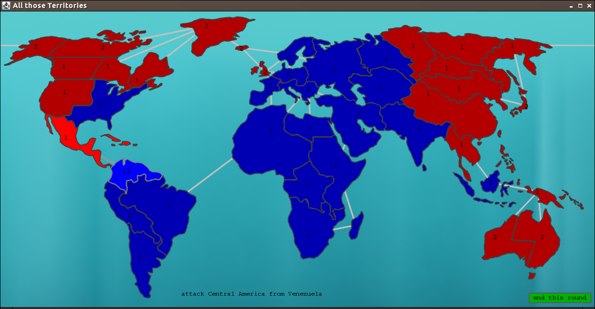

# pk-risk
Abschlussaufgabe PK Wintersemester 2015/16

## installation guide
To install it just open it in a IDE of your choose. We already added the preconfigured Intellij settings. You might just 
be asked to locate your Java JDK. Be sure to use Java 8+. You might also be forced to add an output folder of the 
compiled files. A clever folder would be either dest or out :)

## About pk-risk
pk-risk is a normal risk game for 1 person. You are playing against the computer. First both sides pick their countries,
till nothing is left. Next they fight, till only 1 country is left. 
For more detailed informations you can read the [instructions](docs/abschlussbeispiel-ws-2015.pdf) (in German)

